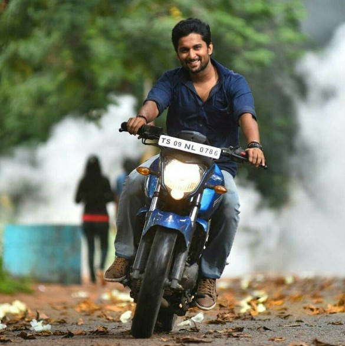
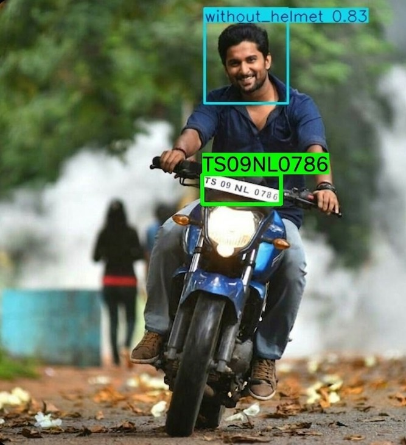
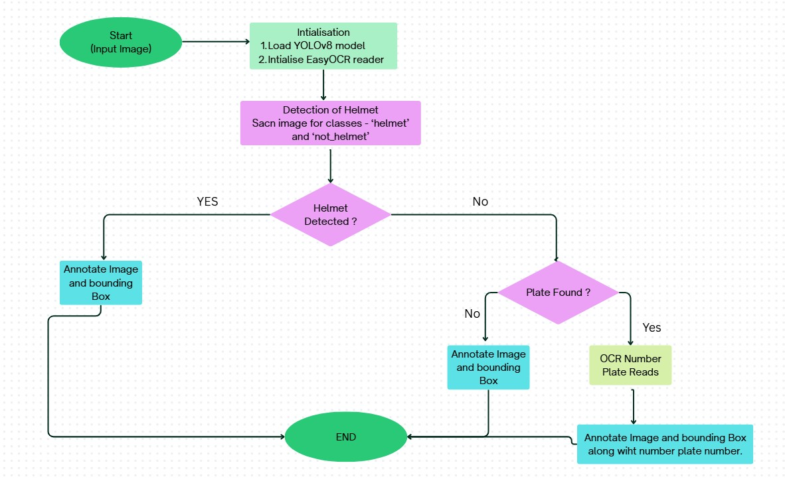
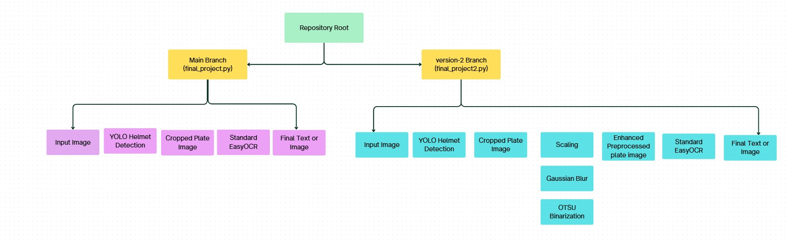
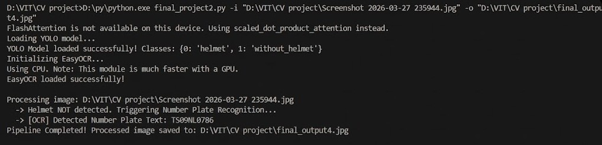

# Helmet-and-number-plate-detection


| Original Image | Detected Output |
| :---: | :---: |
|  |  |

## Background and Motivation of this project  
With the rapid increase in the number of two-wheeled vehicles on the road, traffic rule violations—particularly riding without a helmet—have become a major contributor to severe road accidents and fatalities. While traffic authorities mandate the use of helmets, manual monitoring and enforcement at a large scale are highly inefficient, labor-intensive, and prone to human error. There is a critical need for an automated, intelligent system capable of monitoring traffic, identifying violators, and extracting their vehicle information for penalization without requiring constant human oversight.

## Proposed Solution
This project introduces a highly efficient, two-stage Computer Vision pipeline designed to automate traffic safety enforcement. The system intelligently links object detection with optical character recognition (OCR) through conditional logic.

Instead of processing every single vehicle for license plate numbers (which is computationally expensive), the system first checks for compliance. It evaluates an input image to detect if a rider is wearing a helmet. If the rider is compliant, the system simply logs the event and moves on. However, if a traffic violation is detected (i.e., the rider is not wearing a helmet), the system automatically triggers a secondary pipeline to locate the motorcycle's license plate, crop it, and extract the registration number.



## Technical Architecture
The project leverages state-of-the-art computer vision libraries and models:

1. **Object Detection (YOLO)** : A custom-trained YOLO (You Only Look Once) model is used for its high-speed and high-accuracy bounding box predictions to identify riders and helmets.

2. **Image Processing (OpenCV)** : If a violation is detected, OpenCV is utilized to convert the image to grayscale, apply bilateral filtering for noise reduction, and use Canny edge detection and contour mapping to isolate the rectangular license plate.

3. **Optical Character Recognition (EasyOCR)** : The cropped license plate undergoes further preprocessing (such as scaling and Otsu's thresholding) before being passed to EasyOCR, a PyTorch-based text recognition model, to accurately extract the alphanumeric registration text.


## Objectives
* **Automation** : To replace manual traffic monitoring with an automated, AI-driven pipeline.

* **Computational Efficiency** : To conserve processing power by utilizing a conditional trigger, ensuring computationally heavy OCR is only run on violators.

* **High Accuracy** : To implement advanced image preprocessing techniques that allow the OCR model to read license plates even in challenging lighting conditions, low resolutions, or when shadowed.

* **Scalability** : To build a modular foundation that can be later expanded from static image processing to real-time video stream analysis.

## 🌿 Repository Branches (Versions)
This repository contains two distinct versions of the pipeline to demonstrate iterative improvements. 

* **`main` Branch (`final_project.py`)  :** The foundational architecture. It connects the YOLO object detection directly to standard EasyOCR reading. Best for high-quality, clear images.
* **`version-2` Branch (`final_project2.py`)  :** The enhanced accuracy pipeline. This version applies advanced image preprocessing techniques (scaling, Gaussian blur, and Otsu's binarization thresholding) to the cropped license plate *before* passing it to EasyOCR. This significantly improves text recognition accuracy on low-resolution, noisy, or shadowed license plates.



| **Feature** | **main Branch (final_project.py)** | **version-2 Branch (final_project2.py)** |
| :--- | :--- | :--- |
| **Pipeline** | Direct YOLO -> EasyOCR | Enhanced Preprocessing -> EasyOCR |
| **Key Technique** | Foundational | Advanced Image Preprocessing (Scaling, Blur, Otsu's) |
| **Input Quality** | High-quality, clear images | Low-res, noisy, shadowed images |
| **Result** | Base Performance | Maximized Accuracy (Significantly Improved) |

To switch between your branches locally, open your terminal (or command prompt) inside your project folder and use the following Git commands.

You can add this quick guide to your README as well, or just use it for your own workflow!

1. Check your current branch
To see which branch you are currently working on, run:

```Bash
git branch
```
(The branch with an asterisk * next to it is your active branch).

2. Switch to the version-2 branch
To switch over to your enhanced pipeline, run:

```Bash
git checkout version-2
```

3. Switch back to the main branch
When you want to go back to your foundational architecture, run:

```Bash
git checkout main
```

---

## 🛠️ Environment Setup & Installation
Follow these steps strictly to run the project on your local machine.
### 1. Prerequisites
* **Python:** Version 3.8, 3.9, 3.10, or 3.11 installed. *(Note: Python 3.12+ may have compatibility issues with older PyTorch versions required by EasyOCR).*
* **Git:** To clone the repository.
* **C++ Build Tools:** Required by EasyOCR for text processing.
### 2. Clone the Repository
Open your terminal or command prompt and run:
```bash
git clone [https://github.com/PiyushVIT346/Helmet-and-number-plate-detection.git](https://github.com/PiyushVIT346/Helmet-and-number-plate-detection.git)
```
### 3. Install Dependencies
With your virtual environment activated, install the required libraries:

```bash
pip install ultralytics easyocr opencv-python numpy imutils
```
### 4. Execution Guide
The script is designed to be run via the Command Line Interface (CLI).
```bash
python final_project.py -i <path_to_input_image> -o <path_to_save_output>
```

-i or --image: (Required) The relative or absolute path to the image you want to test.  

-o or --output: (Optional) The path where the final annotated image will be saved. Defaults to output.jpg if not provided.

Example Run
```Bash
python final_project.py -i "image_try.jpg" -o "final_output1.jpg"
```

---
### Output in terminal



### 📂 Project Directory Structure

```text
Helmet-and-number-plate-detection/
│
├── Helmet dataset/               # Dataset directory
│   ├── test/
│   ├── train/
│   ├── valid/
│   ├── README.dataset.txt
│   ├── README.roboflow.txt
│   └── data.yaml
│
├── model_training/               # Scripts/Notebooks for training the model
│   ├── Untitled10.ipynb
│   └── number_plate_using_ocr2.py
│
├── notebook/                     # Testing and inference notebooks/scripts
│   ├── output/Predicted Images/
│   ├── helmet_detection_yolo.py
│   ├── image1.jpg
│   ├── image2.jpg
│   ├── image3.jpg
│   ├── image4.jpg
│   └── number_plate.ipynb
│
├── .gitignore                    # Ignores local datasets and large weight files
├── LICENSE                       # Project license
├── README.md                     # Project documentation
├── Screenshot 2026-03-27...      
├── best.pt                       # YOLO model weights (USER MUST ADD THIS MANUALLY)
├── final_output1.jpg
├── final_output2.jpg
├── final_output3.jpg
├── final_project.py              # Main execution script (Version 1)
├── final_project2.py             # (Available ONLY on the 'version-2' branch)
├── image4.jpg
├── image_try.jpg
└── nohelplate.jpg
```
